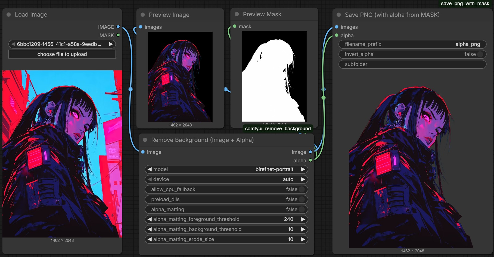

# ComfyUI Background Removal



Custom ComfyUI node for background removal in images. Built on top of **rembg** (with ONNX models) and Pillow (PIL) 
It takes an image as input and produces an image (IMAGE) and an alpha mask (MASK) as output.

## Quickstart

1. Install [ComfyUI](https://docs.comfy.org/get_started).
2. Activate ComfyUI virual environment. For example:
``
source venv/bin/activate
``
3. Install node in `custom_nodes` folder:
```
cd ComfyUI/custom_nodes
git clone https://github.com/d3cker/comfyui_remove_background
```
4. Install requirements
```
cd comfyui_remove_background
pip3 install -r requirements.txt
```

# Features

- For all features please read [rembg](https://github.com/danielgatis/rembg) documentation. 
- Muli-GPU / CPU support
- Preload dlls for Windows
- Alpha matting (CPU)

# Options

- model: Choose prefered model.
- device: auto/cpu/cuda:1/cuda:2, etc.
- allow_cpu_fallback: Fallback to CPU if GPU not available.
- alpha_matting: Enables alpha matting to refine the alpha channel and improve edge separation (e.g., hair, fur, semi-transparent edges).
- alpha_matting_background_threshold: Mask value at or below this is treated as sure background when building the trimap (lower = less aggressive background)
- alpha_matting_foreground_threshold: Mask value at or above this is treated as sure foreground when building the trimap (higher = stricter foreground).
- alpha_matting_erode_size: Erosion size used to shrink sure foreground/background regions, increasing the “unknown” band for matting (larger = wider refinement zone, slower/more smoothing).

# Supported models

List from **rembg** repository:

```
- u2net - A pre-trained model for general use cases.
- u2netp - A lightweight version of u2net model.
- u2net_human_seg : A pre-trained model for human segmentation.
- u2net_cloth_seg - A pre-trained model for Cloths Parsing from human portrait. Here clothes are parsed into 3 category: Upper body, Lower body and Full body.
- silueta - Same as u2net but the size is reduced to 43Mb.
- isnet-general-use - A new pre-trained model for general use cases.
- isnet-anime - A high-accuracy segmentation for anime character.
- sam - A pre-trained model for any use cases.
- birefnet-general - A pre-trained model for general use cases.
- birefnet-general-lite - A light pre-trained model for general use cases.
- birefnet-portrait - A pre-trained model for human portraits.
- birefnet-dis - A pre-trained model for dichotomous image segmentation (DIS).
- birefnet-hrsod - A pre-trained model for high-resolution salient object detection (HRSOD).
- birefnet-cod - A pre-trained model for concealed object detection (COD).
- birefnet-massive - A pre-trained model with massive dataset.
```